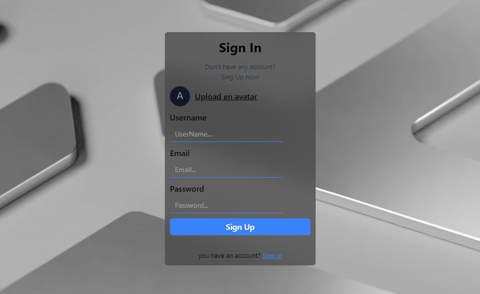
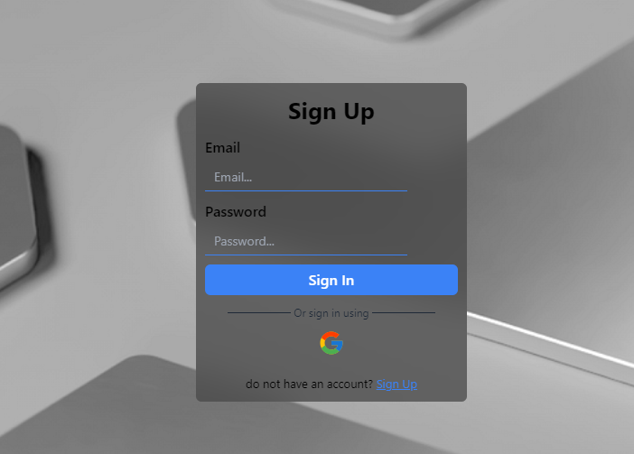
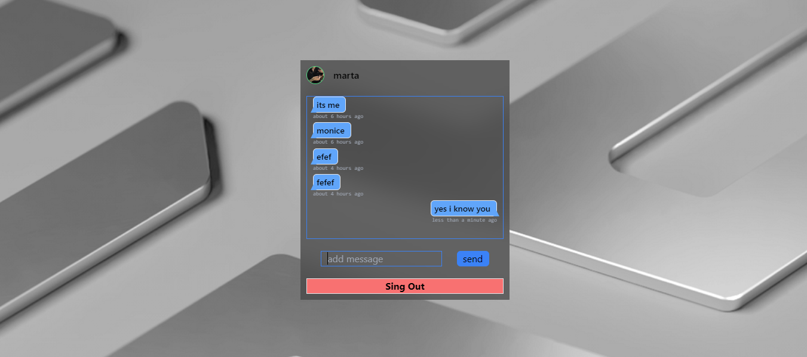

# Chat Application

This is a chat application built with React and Firebase. Users can sign up, sign in, and chat in real-time within different rooms. 

## Features
- User Authentication (Sign up, Sign in, Sign out)
- Real-time messaging
- Room creation and joining
- Responsive design

## Technologies Used
- React
- Firebase (Firestore, Authentication)
- Tailwind CSS
- Date-fns (for time formatting)
- React Toastify (for notifications)


## Screenshot






## Installation

1. Clone the repository:
   ```bash
   git clone https://github.com/0uali-Yassine/chat-app.git
   cd chat-app

2. Install dependencies:
    ```bash
    npm install

3. Set up environment variables:
    -Create a .env file in the root directory.
    -Add your Spoonacular API key to the .env file
    ```bash
    REACT_APP_FIREBASE_API_KEY=your_api_key
    REACT_APP_FIREBASE_AUTH_DOMAIN=your_auth_domain
    REACT_APP_FIREBASE_PROJECT_ID=your_project_id
    REACT_APP_FIREBASE_STORAGE_BUCKET=your_storage_bucket
    REACT_APP_FIREBASE_MESSAGING_SENDER_ID=your_messaging_sender_id
    REACT_APP_FIREBASE_APP_ID=your_app_id


4. Start the development server:
    ```bash
    npm start
5. Open your browser and visit http://localhost:3000 to view the mini chat app.

## Folder Structure
````
src
├── assets
│   ├── avatar.png
│   ├── emoji.png
│   ├── original-e03834c9fc997ae84e889971b7f9400c.png
├── components
│   ├── Auth.js
│   ├── Chat.js
│   ├── Room.js
├── Context.js
├── firebase.config
│   └── config.js
├── App.js
├── index.js
```
## Components
- [App.js](#App)
- [Auth.js](#Auth)
- [Chat.js](#Chat)
- [Room.js](#Room)
- [Context.js](#Context)
- [Styling](#Styling)
- [Firebase Setup](#Firebase Setup)

## App.js

The main component that decides which screen to show based on the user's authentication and room status.

## Auth.js

Handles user sign-up and sign-in using email/password and Google authentication.

## Chat.js

Displays the chat interface where users can send and receive messages in real-time.

## Room.js

Allows users to create or join a chat room.

## Context.js

Provides a global context for authentication state and room management.

## Styling

This project uses Tailwind CSS for styling. Classes are directly added in the JSX elements.

## Firebase Setup

This project uses Firebase for authentication and Firestore for real-time data management. Make sure to configure your Firebase project and update the config.js file with your project's credentials.

### Usage
- Sign up or sign in using your email or Google account.
- Create or join a room.
- Start chatting in real-time with other users in the same room.
- Sign out when done.


## Credits

This project was created by [0uali-Yassine].
